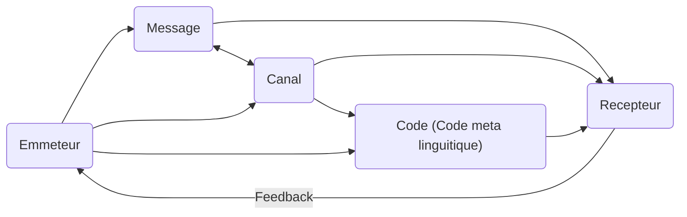

1. Communiquer signier parler et se faire comprendre par une personne. Egalement, c'est la fait de partager une connaissance ou un savoir. Pour communiquer, il faut utiliser des techniques de communication.
   Communiquer ⇒ Mettre en commun
   Comm nn verbale : gesture postuelle, mvmnt, regard, mimique, l'intonation, rythme, débit
   Comm verbale : voix, parole, écrit (+ lange signe), langue (une norme, c'est un code ⇒ Des conventions)
   Un code : Un son et une forme graphique, idéogramme
   Emmeteur = celui qui dit l'info → Message (info, connaissance, savoir) → Récepteur = 1 personne ou gpe de personne
   Communiquer = au moins être deux + avoir un message qui est un message qui est un code
   Emmeteur - récepteur = humain - humain, humain - robot, robot - humain, robot - robot. Aussi animal, si il n'a pas a mangé, il sait très bien se faire comprendre
   L'image est à la fois support et code (un tableau, le code sont les formes, les lignes, les couleurs) 
   Il faut un canal physique (ondes sonors + langue, plus son qui passe par corps. Pour langue signe, canal = main)
   ⇒ **Orchestre + tableau ..**, considéré comme communication (émetteur = musiciens, canal = instruments, récepteurs = public + potentiellement code si grand orchestre)
   Pour la communication, il faut d'abord qu'il y ait la **volonté** + émotion
   Si collab + partage + mettre en commun, ça doit être dans les deux sens (un retour). La non-récriprocité brouille la comm. C'est aussi du bruit.
   Le bruit dans la comm. est tout ce qui gêne le msg (silence, bruit perturbateur) ⇒ Element contextuel (chaleur, faim ...) ⇒ **Feedback**
   La communication se passe dans un contexte (situation de communication ou  situation d'énonciation, dans quel ctxt l'énonciation est faite) + un ctxt commun. Situation temporelle et spatiale. Aussi possible comm différée (pas le même espace de comm comme livre ou jeu vidéo) ou ctxt explicité (Dialogue "cette fenêtre", on ne comprend pas. Mais si on nous l'a décrit ... ctxt, on comprend mieux)
   Il faut savoir qui est son récepteur + visée du msg. (**Exemple :** savoir expliquer des choses complexes simplement si visée = personne nn qualifiée dans ce que je fais)
   Le sens est construit à deux : co-construit. Collaborer, partager ...
   La manière dont j'agence les éléments de mon code peut produire le mm sens mais ce sont ces techniques qui change un effet
   Il faut la volonté de partager mais aussi la volonté d'apprendre

⇒ **Communiquer, c'est partager un message qui a du sens avec tous les moyens de communications mis à ma disposition (code, canal), c'est établir une relation entre deux personnes.**

**Bilan**

- Pronociation
- Synthaxe
- Vocabulaire

→ D'indices dans les paroles et aussi dans le conntexte
→ Supports écrits, oraux et imagés