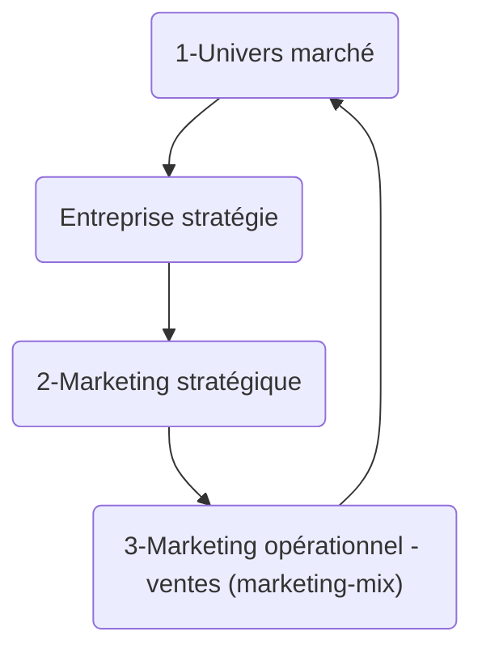

[[Les fonctions principales d'une entreprise]]
[[Les fonctions supports d'une entreprise]]

# La fonction achat - Approvisionnement
[[Processus achat]]
[[Processus approvisionnement]]

# La fonction production
[[La mission de l'entreprise]]
[[Etapes de productions]]
[[Modes de production]]

# Définition
[[Définition - Capacité]]
[[Définition - Charge]]

# Les différentes fonctions
[[La fonction comptable et financière]]
[[Permanent/Autre/La fonction RH|La fonction RH]]

## La fonction recherche et développement
L'innovation est importante pour une entreprise car elle permet de créer de nouveaux produits et services en tenant compte de différents objectifs tels que la faisabilité technique, la rentabilité économique et les compétences de l'entreprise. Cela garantit la pérennité commerciale de l'entreprise en lançant de nouvelles gammes de produits et en soutenant l'innovation pour rendre le produit plus attractif pour les consommateurs par rapport aux autres concurrents. L'innovation passe par différentes étapes, depuis la recherche en laboratoire jusqu'à la production en usine et nécessite une équipe de professionnels incluant des ingénieurs et des gestionnaires pour assurer un succès optimal.

## La recherche de direction-managers haut de la hiérarchie
La gestion d'entreprise vise à planifier l'avenir en choisissant les bonnes actions, en gérant les différents secteurs de l'entreprise, en donnant des instructions claires, en veillant à ce que toutes les actions soient coordonnées et à ce que les erreurs soient rapidement corrigées. Le but de la gestion est d'assurer la pérennité de l'entreprise à long terme en prenant des décisions stratégiques cruciales. Le gestionnaire est comparable à un capitaine de bateau ou un chef d'orchestre qui mène sa troupe vers un objectif commun et qui évite les dysfonctionnements et les conflits.

**La démarche marketing** :

