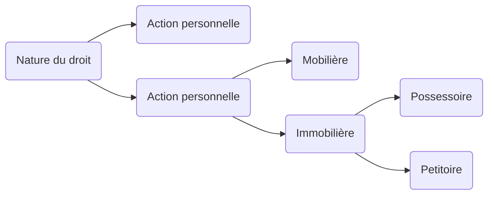

**Action en justice**
Introduction :
- Moyen pour le titulaire d'un droit subjectif contesté de faire reconnaitre son droit en justice
- Conditions
	- Intérêt à agir
	- Qualité à agir
Différents types d'actions :

- Ordre judiciaire / Ordre administratif
- Application du principe de séparation des pouvoirs
- Tribunal des conflits : gérer les conflits entre les deux ordres

# Les principes d'organisations judiciaire : voies de recours
| Ordinaires | Exra-ordinaires      |     |
| ---------- | -------------------- | --- |
| Appel      | Tierce opposition    |     |
| Opposition | Pourvoi en cassation |     |
|            | Recours en révision  |     |

