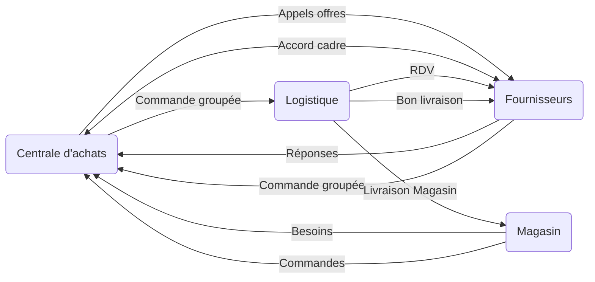

Document 1
> Il y a un suivi de production très stricte : Les fournisseurs louent des bâtiments à côté de l'usine pour stocker leurs pièces afin d'arriver au plus vite après la commande du client (6 heures)
> Grande flexibilité : Les équipes gèrent une 20aine d'assemblages différents pour des clients internationaux
> Utilisation d'un système de gestion de production high-tech breveté
> Des écrans plasma dans toute l'usine pour :
> - afficher le système (avec horaires où il faut que ce soit fait - le directeur vient vérifir)
> - Indicateurs de performance (qualité, livraisons, disponibilité pièces, problèmes ...)
> ⇒ Système de transparance apprecié des employés

**Document 2**
> 1. Le but du WMS est d'acquérir de nouveaux gains de productivité en augmentant le service. Ils voulaient installer la radiofréquence, économiser 16.000h, fiabiliser ses stocks en supprimant les débords et accélérer les traitements des réceptions et des expéditions pour mieux servir ses magasins
> 2. .
> 	1. Fournisseur
> 	2. logistique
> 	3. centrale d'achat : négocier prix avec entrepôt
>
> 3. Acteurs :
> 	1. Centrale d'achat : Sélectionner les fournisseurs et négociations
> 	2. Logistique : Supply chain performante. Prévoir délais de livraisons, réceptionner, ranger, contrôler
> 	3. Etre plus performant
> 	4. Ils ont dépassés leurs prévisions
> 4. Concepts :
> 	1. [[Débord logistique]]
> 	2. [[Cross Docking (Passage à quai)]]
> 5. Automatiser l'intégrite des références, fluidifier les lux : gagner en performance

[[Pilotage de la SCM (les indicateurs]]

