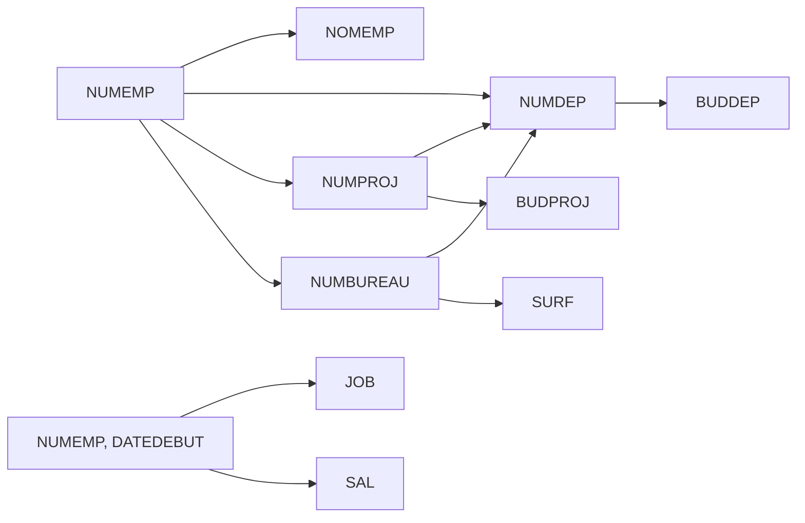
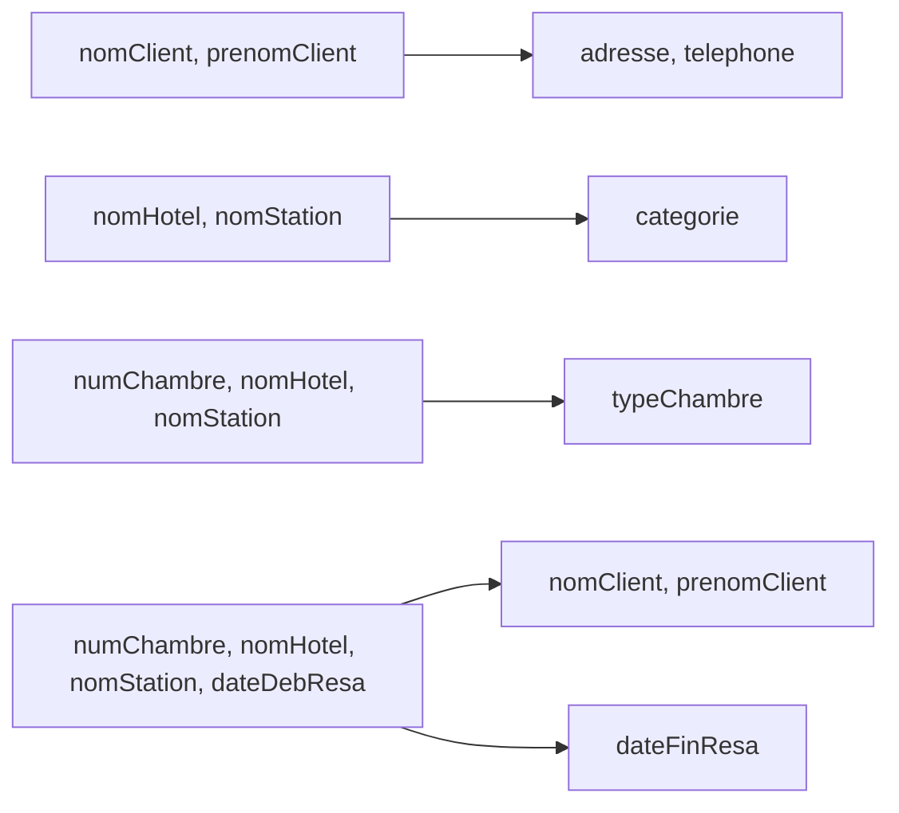

# Exercice 3

**Question 1**
> Dépendances fonctionnelles non élémentaires :
> - **DF12** : N°UE, N°TD → NomUE est non élémentaire car on a déjà DF7 : N°UE → NomUE
> - **DF14** : N°UE, N°Etud → N°Ens est non élémentaire car on peut la déduire de DF8 et DF13 :  
N°UE, N°Etud → N°TD et N°UE, N°TD → N°Ens

**Question 2**
> Couverture minimale $F'$
> - F' = {  
DF1 : N°Etud → NomEtud  
DF2 : N°Etud → PrénomEtud  
DF3 : N°Etud → AdresseEtud  
DF4 : N°Ens → NomEns  
DF5 : N°Ens → PrénomEns  
DF6 : N°Ens → AdresseEns  
DF7 : N°UE → NomUE  
DF8 : N°UE, N°Etud → N°TD  
DF9 : N°UE, N°Etud → DateIns  
DF10 : N°UE, N°TD → Horaire  
DF11 : N°UE, N°TD → Salle  
DF13 : N°UE, N°TD → N°Ens  
}
> **Justification** :
> - DF12 et DF14 ont été supprimées car non élémentaires
> - Toutes les DF restantes sont élémentaires
> - Il n'y a pas de DF redondante
> - Les parties gauches des DF sont minimales

**Question 3**
La clé est (N°UE, N°Etud). En effet, à partir de ces attributs, on peut déterminer tous les autres :
- N°TD (par DF8)
- DateIns (par DF9)
- Horaire, Salle, N°Ens (par DF10, DF11, DF13 via N°TD)
- NomUE (par DF7)
- NomEtud, PrénomEtud, AdresseEtud (par DF1, DF2, DF3)
- NomEns, PrénomEns, AdresseEns (par DF4, DF5, DF6 via N°Ens)

**Question 4**
Décomposition en 3FN :
R1(<u>N°Etud</u>, NomEtud, PrénomEtud, AdresseEtud)  
R2(<u>N°Ens</u>, NomEns, PrénomEns, AdresseEns)  
R3(<u>N°UE</u>, NomUE)  
R4(<u>N°UE, N°TD</u>, Horaire, Salle, N°Ens)  
R5(<u>N°UE, N°Etud</u>, N°TD, DateIns)

Cette décomposition est en 3FN, sans perte d'informations et sans perte de dépendances fonctionnelles.

## Exercice 4
**Question 1**

**Question 2** :
> La relation universelle R n'est pas en 3NF (Troisième Forme Normale) car il existe des dépendances transitives. Par exemple, NUMEMP → NUMDEP → BUDDEP.

**Question 3** :
> Cette décomposition est en 3NF car :
>- Chaque attribut non-clé dépend uniquement de la clé primaire de sa relation.
>- Il n'y a pas de dépendances transitives.
>- Toutes les dépendances fonctionnelles sont préservées.  
>- Il n'y a pas de perte d'information car on peut reconstituer la relation universelle par des jointures naturelles.

## Exercice 5

1. a. OUI uniqument s'ils ne sont pas sur la même station
    
    b. OUI. Aucune DF n'empêche un client de louer plusieurs chambres.
    
    c. OUI. Aucune DF n'indique qu'une station n'a qu'un seul hôtel.
    
2. Oui, il existe des DF non élémentaires :
    
    - DF4 est non élémentaire car elle peut être déduite de DF2 et DF3.
        
    - DF6 est non élémentaire car elle peut être déduite de DF5 et DF1.
        
    - DF8 est non élémentaire car elle peut être déduite de DF3.
        
3. Oui, il existe des DF élémentaires redondantes :
    
    - DF4 est redondante car elle peut être déduite de DF2 et DF3.
        
    - DF6 est redondante car elle peut être déduite de DF5 et DF1.
        
    - DF8 est redondante car elle est identique à DF3.
        
4. Graphe des dépendances fonctionnelles de F' :
    

1. Les clés de la relation HOTEL sont nomHotel, numChambre, nomStation, dateRes. Chaque elt de lac lé n'est jamais en partie droite de DF et à partir de ces 4 attributs, on peut retrouver tous les autres. 
    
2. La relation HOTEL n'est pas en 3FN car il existe des dépendances transitives. Par exemple, (numChambre, nomHotel, nomStation, dateDebResa) → (nomClient, prenomClient) → (adresse, telephone). Elle est en 1FN car que attribut représente une chose unique . Des informations qui devraient être regroupées sont séparées en plusieurs tables
    
7. a) Il y a perte de DF. Par exemple, la DF2 (nomHotel, nomStation → categorie) n'est pas préservée dans cette décomposition.
    
    b) Il n'y a pas de perte d'information car on peut reconstituer la relation originale par jointure naturelle des trois relations.
    
    c)
    
    - Client : Clé = (nomClient, prenomClient), 3FN
        
    - Chambre : Clé = (nomHotel, nomStation, numChambre), pas en 3FN car categorie dépend de (nomHotel, nomStation)
        
    - Resa : Clé = (nomClient, prenomClient, numChambre, dateDebResa), 3FN
        
8. Décomposition en 3FN sans perte d'information et de DF :
    
    Client(<u>nomClient, prenomClient</u>, adresse, telephone)  
    Hotel(<u>nomHotel, nomStation</u>, categorie)  
    Chambre(<u>numChambre, nomHotel, nomStation</u>, typeChambre)  
    Reservation(<u>numChambre, nomHotel, nomStation, dateDebResa</u>, dateFinResa, nomClient, prenomClient)
    

Cette décomposition est en 3FN, préserve l'information et les dépendances fonctionnelles.